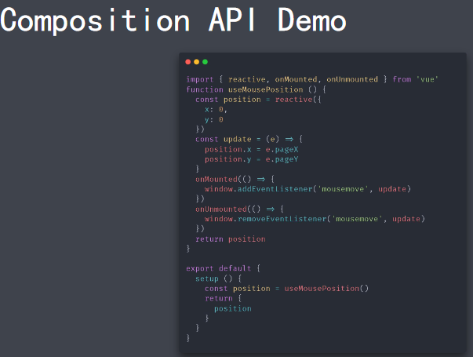

### Vue.js 3.0 源码组织方式

Vue.js 3.0
- 源码组织方式的变化
- Composition API
- 性能提升
- Vite

源码组织方式
- 源码采用 TypeScript 重写
- 使用 Monorepo 管理项目结构

packages 目录结构

### 不同的构建版本
- cjs
    - vue.cjs.js
    - vue.cjs.prod.js
- global
    - vue.global.js
    - vue.global.prod.js
    - vue.runtime.global.js
    - vue.runtime.global.prod.js
- browser
    - vue.esm-browser.js
    - vue.esm-browser.prod.js
    - vue.runtime.esm-browser.js
    - vue.runtime.esm-browser.prod.js
- bundler
    - vue.esm-bundler.js
    - vue.runtime.esm-bundler.js

### Composition API 设计动机
Composition API
- RFC(RequestForComments)
    - https://github.com/vuejs/rfcs
    
- CompositionAPIRFC
    - https://composition-api.vuejs.org

设计动机
- Options API
    - 包含一个描述组件选项（data、methods、props等）的对象
    - Oprions API 开发复杂组件，同一个功能逻辑的代码被拆分到不同选项

设计动机
- Composition API
    - Vue.js3.0新增的一组API
    - 一组基于函数的API
    - 可以更灵活的组织组件的逻辑

3.0中两种都可以使用

### 性能提升
性能提升
- 响应式系统升级
- 编译优化
- 源码体积的优化

响应式系统升级
- Vue.js 2.x 中响应式系统的核心 defineProperty
- Vue.js 3.0 中使用 Proxy 对象重写响应式系统
    - 可以监听动态新增的属性
    - 可以监听删除的属性
    - 可以监听数组的索引和 length 属性

编译优化
- Vue.js2.x中通过标记静态根节点，优化diff的过程
- Vue.js3.0中标记和提升所有的静态根节点，diff的时候只需要对比动态节点内容
    - Fragments（升级vetur插件）
    - 静态提升
    - Patchflag
    - 缓存事件处理函数

优化打包体积
- Vue.js3.0中移除了一些不常用的API
    - 例如：inline-template、filter等
- Tree-shaking

### Vite
ESModule
- 现代浏览器都支持ESModule（IE不支持）
- 通过下面的方式加载模块
    - <scripttype="module"src="..."></script>
- 支持模块的script默认延迟加载
    - 类似于script标签设置defer
    - 在文档解析完成后，触发DOMContentLoaded事件前执行

ViteasVue-CLI
- Vite在开发模式下不需要打包可以直接运行
- Vue-CLI开发模式下必须对项目打包才可以运行

Vite特点
- 快速冷启动
- 按需编译
- 模块热更新

ViteasVue-CLI
- Vite在生产环境下使用Rollup打包
    - 基于ESModule的方式打包
- Vue-CLI使用Webpack打包

